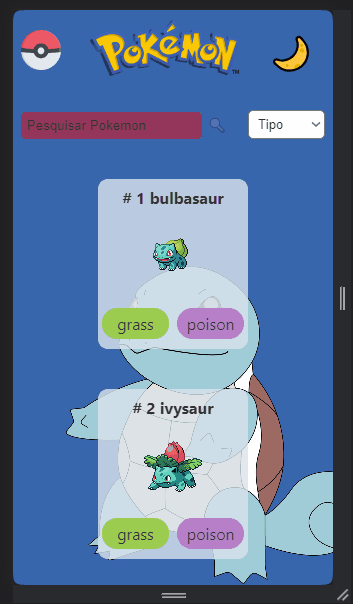

# Pokédex API 

## Quest React Avançado - DevQuest 

### Demonstração Desktop 


### Demonstração Mobile


### Descrição do projeto

Esse projeto tem como objetivo testar os conhecimentos adquiridos no curso como um todo.
Nesse será explorado: 
- API para extrair informações dos pokmeons
- React para trabalhar com componentes
- React Router DOM para alternar entre páginas
- Single Page Application (SPA)
- Styled Components para fazer toda estilização
- Context API para alterar tema e salvá-lo no local storage

O projeto consiste em puxar as infomações da API (PokeApi) através de diferentes endpoints e renderizar na tela:

- Cabaçalho
    - Logo do pokemon para voltar para pagina inicial
    - Botão para trocar entre tema claro e securo 

- Página inicial
    - Uma lista de 10 pokemons inicialmente
    - Carregar mais pokemons com clique de botão
    - Buscar um pokemon pelo nome ou pelo id
    - Filtrar pokemons pelo tipo ou pelo nome
    - Mostrar

- Pagina de detalhes
    - Mostrar nome, id, tipos e imagem diferente do pokemon
    - Altura e peso
    - Habilidades e suas descrições
    - Lista de movimentos

### O que aprendi

A parte mais importante e desafiadora desse projeto, certamente foi trabalhar com a API.

Foi necessário diversos endpoints para buscar um pokemon, as informações do pokemon, a lista de pokemons e suas hablidades.
Trabalhar com async functions e Promise.all para aguardar o retorno da API.

Passar temas através do Context API.

Buscar propriedades do tema dentro de um styled component.

Gerenciar as páginas com React Router DOM.

### Como executar o projeto

1 - Clone do repositório através do link ou faça o download ZIP: 
```
https://github.com/WalassiSilva/pokedex-api.git
``` 
2 - Abra o projeto via terminal ou pela IDE
3 - Instale a dependências do projeto:
```
npm install
```
4 - De start no Projeto
```
npm start
```
5 - Acesse o link do localhost com ctrl + clique